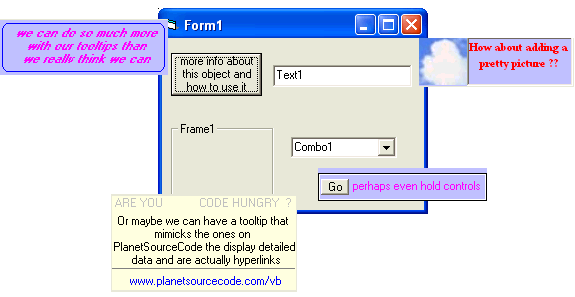



## Fancy Tooltips  implementing different

### Description

This is a unique way of implementing tooltips in your project that allows you to totally customize each individual tooltip for each individual control in your project. in addition, the tooltip can recieve a mousedown event just like the tooltips in planets tooltips
 
### More Info
 

             |
---                |---
**Submitted On**   |2005-01-25 02:09:14
**By**             |[Evan Toder](https://github.com/Planet-Source-Code/PSCIndex/blob/master/ByAuthor/evan-toder.md)
**Level**          |Intermediate
**User Rating**    |4.3 (13 globes from 3 users)
**Compatibility**  |VB 3\.0, VB 4\.0 \(16\-bit\), VB 4\.0 \(32\-bit\), VB 5\.0, VB 6\.0, ASP \(Active Server Pages\) , VBA MS Access
**Category**       |[Custom Controls/ Forms/  Menus](https://github.com/Planet-Source-Code/PSCIndex/blob/master/ByCategory/custom-controls-forms-menus__1-4.md)
**World**          |[Visual Basic](https://github.com/Planet-Source-Code/PSCIndex/blob/master/ByWorld/visual-basic.md)
**Archive File**   |[Fancy\_Tool1843921252005\.zip](https://github.com/Planet-Source-Code/evan-toder-fancy-tooltips-implementing-different__1-58485/archive/master.zip)

